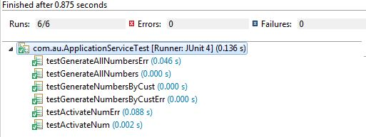
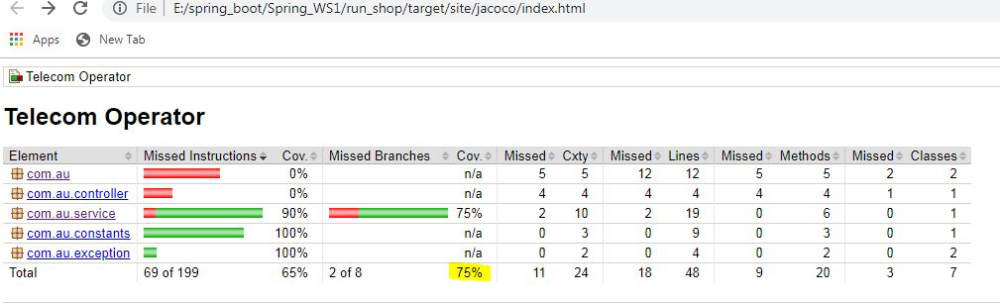
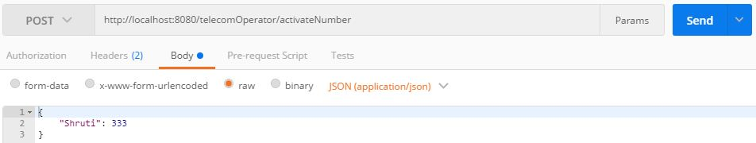
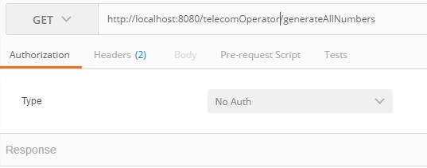
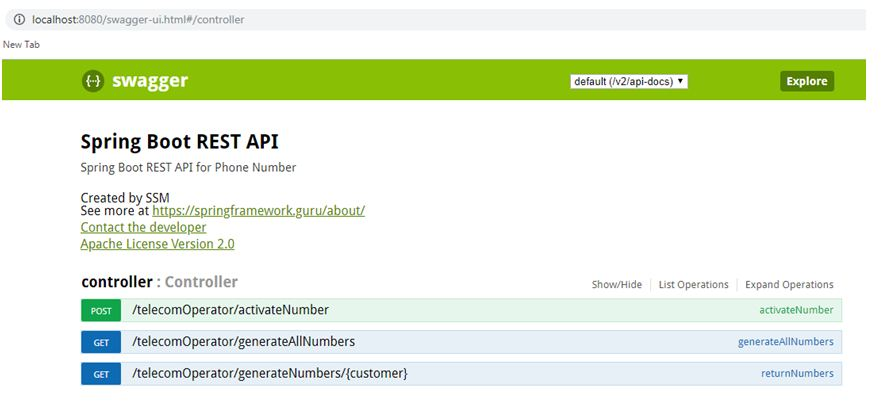

Telecom Operator
===============
Some Problem Statement
•	task1
•	task2
•	task3

# Installation
No initial setup is required

# Prerequisites
* java >= 1.8
* maven 3.6.1

# Requirements
Implemented and tested using Java 8 
Tests require JUnit and Mockito 
Project dependencies and compiling managed by Maven 
Code coverage done using Jacoco

# Run:
Set configuration for Application(main) class

# Additional Enhancements

Implement authentication and session state 
Can be implemented with Crud repositories 

# Test Cases Executed

# Code Coverage 75%

# Testing using Postman

    

# API Interface Using Swagger

